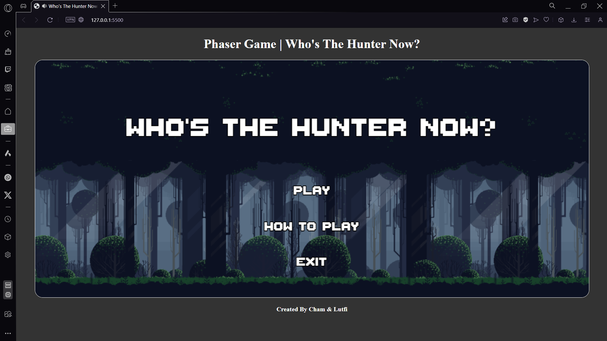
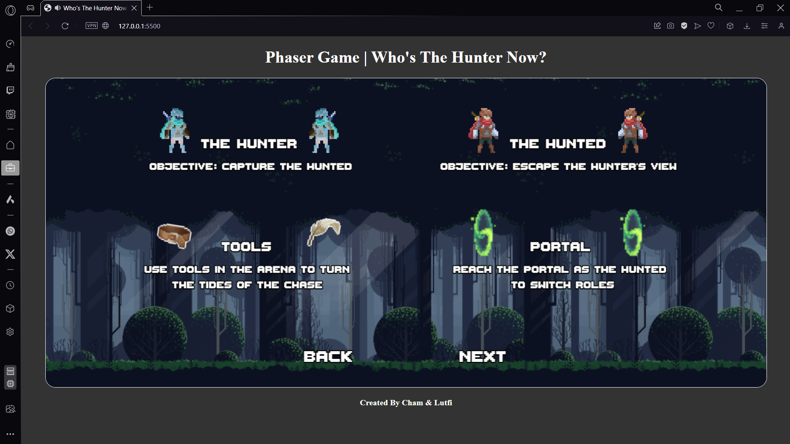
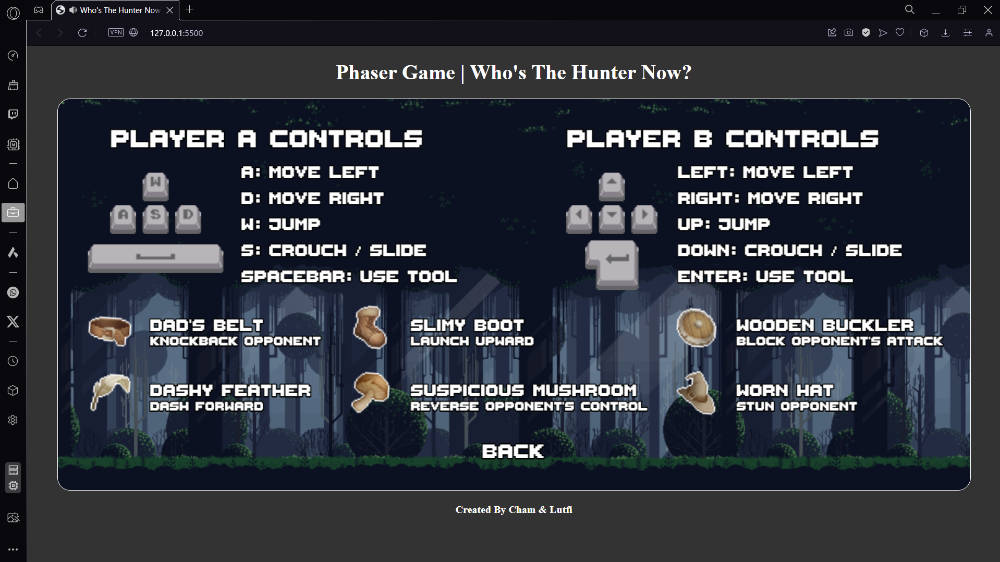
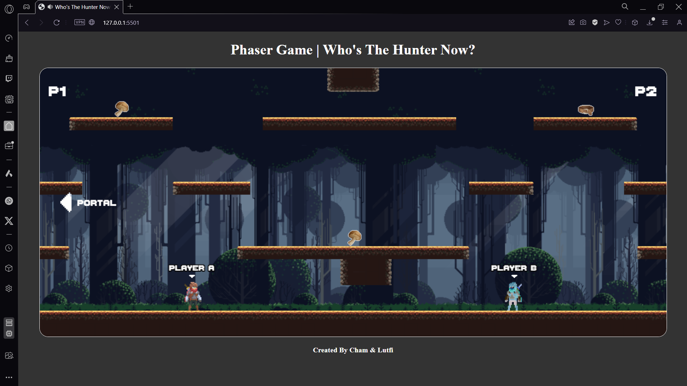

# Who's The Hunter Now?
Who's The Hunter Now? is a local multiplayer 2D platformer game revolves around the concept of Chase Tagging, where players alternate between being the hunter and the hunted.

## Overview
Player navigates through an arena, trying to reach his goal while being relentlessly hunted by his opponent. Upon reaching the goal, the player switches role and become the hunter. 

The dynamics of the game shift as the previous hunter now becomes the hunted. The hunted opponent must now quickly adapt and navigate to a new goal, allowing them to reclaim their role as the hunter. This cycle continues until one player emerges victorious by successfully hunting down his opponent. 

Throughout the game, players will encounter various random tools placed in the arena, providing opportunities to outmaneuver and outplay their opponents in this intense game of chase and strategy.

## User Manual
- ### Installation: 
    Simply download the game files and open the index.html file in a web browser.
- ### Objective
    1. As The Hunter, stop The Hunted from reaching the portal and capture him.
    2. As The Hunted, reach the portal to become The Hunter or put enough distance so that The Hunter can no longer tracks you.
- ### Controls
    Basic controls for players:

    | ***Action***   | ***Player A***| ***Player B***|
    |----------------|---------------|---------------|
    | Move Left      | A             | Left Arrow    |
    | Move Right     | D             | Right Arrow   |
    | Jump           | W             | Up Arrow      |
    | Crouch / Slide | S             | Down Arrow    |
    | Use Tools      | Spacebar      | Enter         |
- ### Tools
    Random tools are scattered throughout the arena to help you outplay your opponent.

    | ***Tools***           |          ***Effects***           |
    |-----------------------|----------------------------------|
    | Dad's Belt            | Knockback The Opponent           |
    | Dashy Feather         | Dash Forward                     |
    | Slimy Boot            | Launch Player Upwards            |
    | Suspicious Mushroom   | Flip Opponent's Controls         |
    | Wooden Buckler        | Block 1 Attack                   |
    | Worn Hat              | Stun The Oppponent               |

## Acknowledgement
We would like to thank our lecturer for his guidance and support throughout the development of this project.

## References
- Phaser Framework: [https://phaser.io/](https://phaser.io/)
- Phaser Documentations: [https://newdocs.phaser.io/](https://newdocs.phaser.io/)
- Game Assets from Itch.io: [https://itch.io/game-assets/](https://itch.io/game-assets/)
- Markdown Documentations: [https://www.markdownguide.org/basic-syntax/](https://www.markdownguide.org/basic-syntax/)

## Credits
- **[SimpleKeys](https://beamedeighth.itch.io/simplekeys-animated-pixel-keyboard-keys)** by ***beamedeighth***
- **[Free Pixel Art Forest](https://edermunizz.itch.io/free-pixel-art-forest)** by ***edermunizz***
- **[Oak Woods — Environment Asset 🍂](https://brullov.itch.io/oak-woods)** by ***brullov***
- **[Animated Pixel Adventurer](https://rvros.itch.io/animated-pixel-hero)** by ***rvros***
- **[Pixel Art Icon Pack RPG](https://cainos.itch.io/pixel-art-icon-pack-rpg)** by ***Cainos***
- **[Fantasy UI Borders](https://kenney-assets.itch.io/fantasy-ui-borders)** by ***Kenney***
- **[Free Pixel Font - Thaleah](https://tinyworlds.itch.io/free-pixel-font-thaleah)** by ***Tiny Worlds***
- **[Pixel Dimensional Portal 32x32](https://pixelnauta.itch.io/pixel-dimensional-portal-32x32)** by ***Pixelnauta***
- **[FilmCow Recorded SFX](https://filmcow.itch.io/filmcow-sfx)** by ***FilmCow***

## Group Members
### 1. Cham Hao Cheng (1211304951)
    - Write Documentations (README.md)
    - Main Menu (Play, How To Play, Exit)
    - End Screen (Winner, Game Duration, Cycle Count, Back To Menu, Restart, Exit)
    - Player Behaviours (Idle, Move, Jump, Fall, Crouch, Slide, Death, Use Items)
    - Elimination Mechanics (Out of Screen, Tagging)
    - Camera Behaviours (Follow Players, Dynamic Zoom)
    - Tools:
        - Dad's Belt
        - Dashy Feather
        - Wooden Buckler
### 2. Muhammad Lutfi Bin Mohd Izzat (1201100521)
    - Find Game and Sound Assets (Itch.io, Zapsplat)
    - SFX Design (Soundtrack, Player Sound Effects, Tool Sound Effects)
    - Level Design (Parallax Background, Platform Layout, Collision Boxes)
    - Core Mechanics (Goal, Role Switch, Random Tool Spawning, Tool Reset)
    - Player UI (Equipped Tools) 
    - Tools:
        - Slimy Boots
        - Suspicious Mushroom
        - Worn Hat

## Demo

[Watch Gameplay](https://google.com)